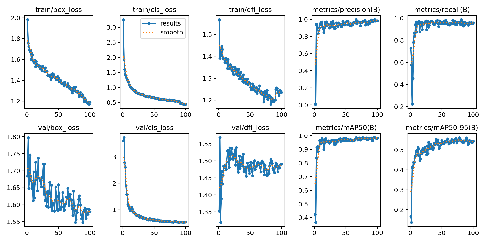
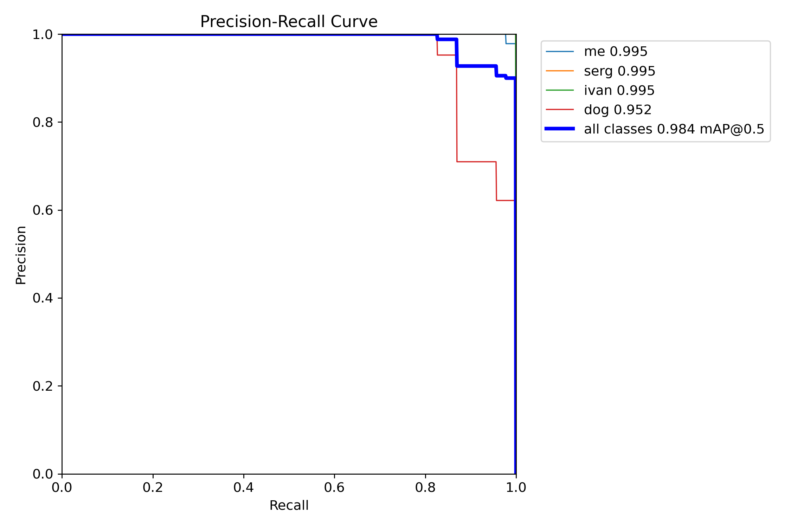
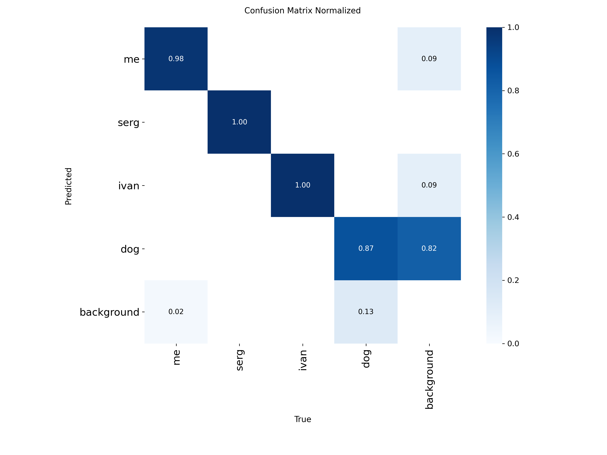

# Детекция объектов на видео с помощью YOLOv8

Этот проект демонстрирует процесс создания и обучения модели компьютерного зрения для обнаружения и классификации конкретных объектов на видеозаписи с уличной камеры. Модель основана на архитектуре YOLOv8 и обучена различать трех конкретных людей и собаку.

## Что такое YOLOv8?

YOLO (You Only Look Once) — это семейство сверточных нейронных сетей для задач детекции объектов в реальном времени. В отличие от классических методов, которые сначала предлагают регионы, а затем классифицируют их, YOLO применяет к изображению единую нейронную сеть, которая предсказывает ограничивающие рамки и вероятности классов за один проход. Это делает алгоритм невероятно быстрым и точным.

**YOLOv8** — это новейшая версия от Ultralytics, предлагающая улучшенную точность, скорость и более удобный фреймворк для обучения и развертывания по сравнению с предыдущими версиями.

## Описание проекта

Цель проекта — создать кастомную модель детекции, способную идентифицировать трех отдельных людей и собаку на видео, снятом камерой наблюдения частного дома. Проект охватывает весь цикл работы с данными: от извлечения кадров и их разметки до обучения модели и анализа ее производительности.

## Структура проекта

```
project-root/
│
├── output_images/          # Папка с извлеченными кадрами (генерируется)
├── dataset/                # Датасет для обучения
│   ├── train/
│   │   ├── images/         # Изображения для обучения
│   │   └── labels/         # Разметка для обучения
│   ├── val/                # Валидационная выборка (images & labels)
│   └── test/               # Тестовая выборка (images & labels)
│
├── runs/                   # Папка для сохранения результатов обучения и детекции (генерируется YOLO)
│   ├── detect/
│   └── train/
│
├── videophoto.py           # Скрипт для извлечения кадров из видео
├── razmetka.py            # Скрипт для ручной разметки данных
├── split.py               # Скрипт для разделения данных на train/val/test
├── train_model.py         # Скрипт для обучения модели YOLOv8
├── inference.py           # Скрипт для тестирования модели на видео
├── best.pt                # Веса лучшей обученной модели
└── README.md              # Этот файл
```

## Классы для детекции

Модель обучена распознавать следующие классы объектов:
*   `me`
*   `serg`
*   `ivan`
*   `dog`
  


### 1. Подготовка данных

**a) Извлечение кадров из видео**
Запустите скрипт `videophoto.py`, чтобы разделить исходное видео на кадры. Скрипт сохранит каждый второй кадр в папку `output_images/`.

**b) Разметка данных**
Используйте скрипт `razmetka.py` для ручной разметки извлеченных кадров. В данном проекте было размечено **500 кадров**. Разметка сохраняется в формате YOLO (один `.txt` файл на изображение) в директорию `dataset/train/`.

**c) Разделение данных на выборки**
Запустите скрипт `split.py`, чтобы разделить размеченные данные на обучающую (70%), валидационную (10%) и тестовую (20%) выборки. Структура папок `dataset/` будет автоматически создана.

### 2. Обучение модели

Обучение производится скриптом `train_model.py`. Модель YOLOv8n обучается в течение 100 эпох. Веса лучшей модели автоматически сохраняются как `best.pt`.

### 4. Тестирование и вывод результатов

Скрипт `inference.py` запускает детекцию на тестовом видео, используя обученную модель (`best.pt`). Результат сохраняется в папке `runs/detect/`.


## Результаты обучения

Модель была успешно обучена на 100 эпохах. Ниже приведены финальные метрики на валидационной выборке:

| Метрика | Значение |
| :--- | :--- |
| **mAP50 (mean Average Precision)** | **0.98333** |
| **mAP50-95** | **0.54545** |
| **Precision** | 0.98193 |
| **Recall** | 0.95646 |

**Потери (Loss) на валидации:**
*   `val/box_loss`: 1.57899
*   `val/cls_loss`: 0.54011
*   `val/dfl_loss`: 1.49064

### Графики обучения (из директории `runs/train/`)
В процессе обучения были сгенерированы следующие ключевые графики:
*   **Графики потерь (Training/Validation Loss)**
*   **График mAP50 по эпохам**
*   **График mAP50-95 по эпохам**
  
*   **Кривые Precision-Recall**
  
*   **Confusion Matrix**
  

Высокое значение **mAP50 (98.3%)** указывает на отличную способность модели точно обнаруживать целевые объекты. Значение **mAP50-95 (54.5%)** является хорошим результатом для кастомной модели, обученной на относительно небольшом датасете.

Ссылка на видео исользованное в проекте: https://disk.yandex.ru/d/avTk2AjwxRBmsg

**Автор:** Цуркан Игорь
